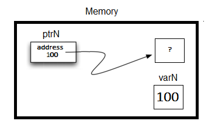

..  Copyright (C)  Jan Pearce and Brad Miller
    This work is licensed under the Creative Commons Attribution-NonCommercial-ShareAlike 4.0 International License. To view a copy of this license, visit http://creativecommons.org/licenses/by-nc-sa/4.0/.

Usando datos en C++
~~~~~~~~~~~~~~~~~

C++ requiere que los usuarios especifiquen el tipo de datos específico 
de cada variable antes de usarla. Los principales tipos de datos atómicos 
integrados de C++ son: entero (``int``), punto flotante (``float``), punto flotante
de doble precisión (``double``), booleano (``bool``) y carácter (``char``). También hay
un tipo especial que contiene una ubicación de memoria llamada ``puntero``. C++
también tiene tipos de datos de colección o compuestos, que se discutirán en un capítulo futuro.

Datos Numéricos
~~~~~~~~~~~~
Los tipos de datos numéricos de C++ incluyen (``int``) para números enteros, (``float``)
para punto flotante, ``double`` para punto flotante de precisión doble.

Las operaciones aritméticas estándar, +, -, \* y /
se utilizan con paréntesis opcionales para forzar el orden de
operaciones fuera de la precedencia normal del operador.

En Python podemos usar ``//`` para dividir enteros.
En C++, declaramos todos los tipos de datos.
Cuando dos números enteros se dividen en C++, la parte entera del
se devuelve el cociente y se elimina la parte fraccionaria.
es decir, cuando se dividen dos enteros, se utiliza la división de enteros.
Para obtener el cociente completo, declarar uno de los números como flotante
convertir todo el resultado en punto flotante.

La exponenciación en C++ se realiza usando ``pow()`` de la biblioteca ``cmath``
y el operador resto (módulo) se hace con ``%``.

Ejecute el siguiente código para ver que comprende cada resultado.

.. tabbed:: intro

  .. tab:: C++

    .. activecode:: intro_1cpp
        :caption: Operadores Aritméticos Básicos C++
        :language: cpp

        #include <iostream>
        #include <cmath>
        using namespace std;

        // Función que realiza varias operaciones matemáticas.
        
        int main(){

            cout << (2+3*4) << endl;
            cout << (2+3)*4 << endl;
            cout << pow(2, 10) << endl;
            cout << float(6)/3 << endl;
            cout << float(7)/3 << endl;
            cout << 7/3 << endl; //En C++ esta es una división de números enteros
            cout << 7%3 << endl;
            cout << float(3)/6 << endl;
            cout << 3/6 << endl;
            cout << 3%6 << endl;
            cout << pow(2, 100) << endl;

            return 0;
        }

  .. tab:: Python

    .. activecode:: intro_1py
        :caption: Operadores Aritméticos Básicos Python

        # Función que realiza varias operaciones matemáticas.
        def main():

            print(2+3*4)
            print((2+3)*4)
            print(2**10)
            print(6/3)
            print(7/3)
            print(7//3)
            print(7%3)
            print(3/6)
            print(3//6)
            print(3%6)
            print(2**100)

        main()

Al declarar variables numéricas en C++,
modificadores como ``short``, ``long`` y ``unsigned``
se puede utilizar opcionalmente para 
garantizar que el espacio se utilice de la manera más eficiente posible.

.. mchoice:: mc_integer_div
   :answer_a: 1
   :answer_b: 1.5
   :answer_c: 2
   :answer_d: Se producirá un error de tiempo de ejecución.
   :answer_e: Ninguna de las anteriores
   :correct: a
   :feedback_a: Correcto!  Es como ``3//2`` en Python.
   :feedback_b: No. Se utiliza la división entera. Intenta otra vez.
   :feedback_c: No. Se utiliza la división entera. Intenta otra vez.
   :feedback_d: No, C++ generalmente va intentar hacer lo que le pides que haga.
   :feedback_e: Uno de los anteriores es correcto.

   ¿Cuál es el resultado de dividir ``3/2`` en C++?

.. mchoice:: mc_exponentiation
  :answer_a: ``4**5``
  :answer_b: ``5**4``
  :answer_c: ``4^5``
  :answer_d: ``pow(4, 5)``
  :correct: d
  :feedback_a: No, ``**`` es usado en Python, no en C++.
  :feedback_b: No, ``**`` es usado en Python, no en C++, y los operadores están invertidos.
  :feedback_c: No. El símbolo ``^`` es un operador valido en C++, pero hace otra cosa.
  :feedback_d: Exactamente! Recuerde que será necesario incluir la biblioteca cmath para que pow() funcione.

  ¿Cómo podría calcular 4 a la quinta en C++?

Datos booleanos
~~~~~~~~~~~~

Los tipos de datos booleanos llevan el nombre de George Boole, un matemático inglés,
por lo que la palabra "Boolean" debe estar en mayúscula. Sin embargo,
el tipo de datos booleano, en C++ usa la palabra clave ``bool``
que no está en mayúscula. Los posibles valores para un valor booleano de 
C++ son "true" y "false" en minúsculas. Note la diferencia en mayúsculas 
de Python. En Python, estos mismos valores están en mayúsculas, pero 
en C++, están en minúsculas.

C++ usa los operadores booleanos estándar, pero se representan de manera diferente
que en Python: "and" en Python es && en C++, "or" es || , y “not”  
es !. Tenga en cuenta que los valores almacenados internamente que representan 
verdadero y falso son en realidad 1 y 0 respectivamente. Por lo tanto, vemos esto 
en el output también.

.. tabbed:: logical1

  .. tab:: C++

    .. activecode:: logical_1cpp
        :caption: Operadores lógicos en C++
        :language: cpp

        #include <iostream>
        using namespace std;

        // función que demuestra los operadores lógicos
        int main() {
          cout << true << endl;
          cout << false << endl;
          cout << (true || false) << endl;
          cout << (true && false) << endl;
          return 0;
        }

  .. tab:: Python

        .. activecode:: logical_1py
            :caption: Operadores Lógicos en Python

            # Función que demuestra operadores lógicos en Python.
            def main():
                print(True)
                print(False)
                print(True or False)
                print(True and False)
            main()

Los objetos de datos booleanos también se utilizan como resultados para los operadores de comparación
como igualdad (==) y mayor que (:math:`>`). Además,
Los operadores relacionales y los operadores lógicos se pueden combinar para
formar preguntas lógicas complejas. :ref:`Table 1 <tab_relational>` muestra los operadores relacionales
y lógicos con ejemplos que se muestran en la siguiente sesión.

.. _tab_relational:

.. table:: **Table 1: C++ Relational and Logical Operators**

    =========================== ============== =================================================================
             **Nombre del Operador**   **Operador**                                                   **Explanation**
    =========================== ============== =================================================================
                      menos que      :math:`<`                                                Less than operator
                   más que      :math:`>`                                             Greater than operator
             menos que o igual     :math:`<=`                                    Less than or equal to operator
          mayor que or igual     :math:`>=`                                 Greater than or equal to operator
                          igual     :math:`==`                                                 Equality operator
                      not equal     :math:`!=`                                                Not equal operator
                    logical and     :math:`&&`                          Both operands true for result to be true
                     logical or     :math:`||`        One or the other operand is true for the result to be true
                    logical not      :math:`!`   Negates the truth value, false becomes true, true becomes false
    =========================== ============== =================================================================

.. tabbed:: basiclogical

  .. tab:: C++

    .. activecode:: locicalcpp
        :caption: Operadores lógicos y relacionales básicos C++
        :language: cpp

        #include <iostream>
        using namespace std;

        // función que demuestra los operadores relacionales.
        int main(){

            cout << (5 == 10) << endl;
            cout << (10 > 5) << endl;
            cout << ((5 >= 1) && (5 <= 10)) << endl;

            return 0;
        }

  .. tab:: Python

    .. activecode:: logicalpy
        :caption: Operadores lógicos y relacionales básicos Python

        # Función que demuestra operadores relacionales
        def main():

            print(5 == 10)
            print(10 > 5)
            print((5 >= 1) and (5 <= 10))

        main()

Cuando se declara una variable de C++, se reserva espacio en la memoria para contener
este tipo de valor.
Una variable de C++ se puede inicializar opcionalmente en la declaración mediante
usando una combinación de una declaración y una instrucción de asignación.

Considere la siguiente sesión:

.. activecode:: booleanpitfall
    :language: cpp

    #include <iostream>
    using namespace std;
    
    // Demostrar como usar las variables en C++ 
    // además, asignamos un entero a una variable booleana,
    //  mostrando la escritura estática de C++.
    int main(){

        int theSum = 4;
        cout << theSum << endl;

        theSum = theSum + 1;
        cout << theSum << endl;

        bool theBool = true;
        cout << theBool << endl;

        theBool = 4;
        cout << theBool << endl;

        return 0;
    }

La declaración ``int theSum = 0;`` crea una variable llamada ``theSum`` 
y la inicializa para contener el valor de datos de ``0``. Al igual que 
en Python, se evalúa el lado derecho de cada declaración de asignación 
y el valor de los datos resultantes se "asigna" a la variable nombrada en el lado izquierdo.

Aquí el tipo de la variable es entero. Debido a que Python se tipifica dinámicamente, 
si el tipo de los datos cambia en el programa, también lo hace el tipo de la variable.
Sin embargo, en C++, el tipo de datos no puede cambiar. Esta es una característica del 
tipo estático de C++. Una variable puede contener siempre un solo tipo de datos.

Trampa: C++ a menudo simplemente intentará hacer la tarea que solicitó sin quejarse. 
Tenga en cuenta lo que sucedió en el código anterior en el resultado final.

.. mchoice:: mc_bool
   :answer_a: Se ignora establecer theBool en cualquier valor que no sea verdadero o falso.
   :answer_b: Establecer theBool en algo > 0 será verdadero y falso de lo contrario.
   :answer_c: false == 0 y true = !false, es decir, todo lo que no sea cero y se pueda convertir a valor booleano no es falso, por lo que debe ser verdadero.
   :answer_d: Ninguno de los anteriores 
   :correct: c
   :feedback_a: No. Intente cambiar el código y configurar theBool en 0.
   :feedback_b: No. Intente cambiar el código y configurar theBool en -4.
   :feedback_c: Correcto!
   :feedback_d: Intenta nuevamente. Uno de los anteriores es correcto. Puede intentar cambiar el código y volver a ejecutar.

   ¿Por qué theBool generó un valor de 1 después de establecerse en 4?

Datos de Carácter
~~~~~~~~~~~~~~

En Python, las cadenas se pueden crear con comillas simples o dobles.
En C++ se utilizan comillas simples para el tipo de datos de carácter (``char``),
y las comillas dobles se utilizan para el tipo de datos de cadena.

Considere el siguiente código.

.. tabbed:: usingchars

  .. tab:: Python

    .. activecode:: charpy
        :caption: Cadenas de Python 

        # Muestra una comparación directa de cadenas y caracteres en Python
        def main():

            strvar = "b"
            charvar = 'b'

            print('b' == charvar)
            print("b" == strvar)
            print('a' == "a")

        main()

  .. tab:: C++

    .. activecode:: charcpp
        :caption: Considerando carácteres y cadenas
        :language: cpp

        #include <iostream>
        #include <string>
        using namespace std;

        // Demuestra cómo caracteres y cadenas no pueden ser
        // comparado directamente.
        int main(){

            string strvar = "b";
            char charvar = 'b';

            cout << ('b' == charvar) << endl;
            cout << ("b" == strvar) << endl;
            //cout << ('a' == "a") << endl; // will error!

            return 0;
        }

Intente responder la siguiente pregunta.

.. mchoice:: mc_cpp_strings
   :answer_a: ' '
   :answer_b: " "
   :answer_c: ' ' o " " puede ser usado
   :answer_d: Depende de la implementación.
   :answer_e: ninguno de los anteriores 
   :correct: b
   :feedback_a: No, las comillas simples solo se usan para caracteres individuales.
   :feedback_b: Buen trabajo leyendo!
   :feedback_c: No. Solo se puede utilizar un conjunto de símbolos.
   :feedback_d: No. La implementación es consistente.
   :feedback_e: Uno de los anteriores es correcto.

   Si quiero crear una cadena en C++, ¿qué conjunto de símbolos se puede usar?

Punteros
~~~~~~~~

Un **puntero** de C++ es una variable que almacena una dirección de memoria y se puede usar para
acceder a los datos almacenados en esa ubicación de memoria.

Sabemos que las variables en un programa de computadora se usan para etiquetar datos con un
identificador descriptivo para que los datos puedan ser accedidos y utilizados por ese
programa de computadora.

Veamos algunos ejemplos de cómo almacenar un número entero en Python y C++.

En Python, cada cosa se almacena como un objeto.
Por lo tanto, una variable de Python es en realidad una referencia a un objeto que se almacena en la memoria.
Por lo tanto, cada variable de Python requiere dos ubicaciones de memoria:
uno para almacenar la referencia y el otro para almacenar el valor de la variable en sí mismo en un objeto.

En C++ el valor de cada variable se almacena directamente en memoria sin necesidad
para una referencia o un objeto. Esto hace que el acceso sea más rápido, pero es uno de
las razones por las que necesitamos declarar cada variable porque los diferentes tipos toman diferentes
cantidades de espacio en la memoria!

El siguiente código declara una variable llamada *varN* que contiene un
valor de 100:

::

    // Referencia de Python para un solo número entero
    varN = 100

.. _fig_py_reference:

.. figure:: Figures/python_reference.png
   :align: center
   :alt: "arrow from varN to box containing 100 object"

   Figure 2.1: Referencia de Python

::

    // Declaración de variables C++ y asignación de un valor entero
    int varN = 100;

En C++, los resultados de ejecutar este código se verán como el siguiente diagrama:
.. _fig_cpp_reference:

.. figure:: Figures/cpp_var.png
   :align: center
   :alt: "Locación nombrado varN conteniendo del valor de 100"

   Figure 2.2: variable en C++ 

En cada caso, cuando queremos enviar el valor a la consola, usamos el nombre de la variable
para hacerlo

Pero también podemos identificar la ubicación de memoria de la variable por su dirección.
Tanto en Python como en C++, esta dirección
puede cambiar cada vez que se ejecuta el programa. En C++, la dirección siempre se verá
extraño porque será la dirección de memoria real escrita en un código hexadecimal
que es un código base 16 como 0x7ffd93f25244.
En Python depende de la implementación,
a veces es un código hexadecimal y a veces solo un conteo u otro
manera de hacer referencia a la dirección.

En Python usamos ``id`` para hacer referencia a la dirección,
mientras que en C++ usamos el operador *address-of*, ``&``.

.. tabbed:: memory-addresses

  .. tab:: C++

    .. activecode:: address_cpp
        :caption: Memory addresses in C++
        :language: cpp

        #include <iostream>
        using namespace std;

        // outputs the value of a variable
        // as well as the memory address in C++.
        int main(){
            int varN = 101;
            cout << varN << endl;
            cout << &varN << endl; //outputs the memory address of variable varN
            return 0;
        }

  .. tab:: Python

    .. activecode:: address_py
        :caption: Memory identifier in Python

        # Outputs the value & memory address of
        # variable titled varN.
        def main():
            varN = 101;
            print(varN)
            print(id(varN)) # ID function returns the memory address in Python.

        main()

Tanto en Python como en C++, las variables se almacenan en ubicaciones de memoria que dependen
sobre la carrera misma. Si ejecuta repetidamente el código anterior en C++ o Python, es posible que
ver el cambio de ubicación.

Como se sugirió anteriormente, en Python, es imposible almacenar una variable directamente.
En su lugar, debemos usar un nombre de variable y una referencia al objeto de datos.
(De ahí la flecha en la imagen).
En C++, las variables almacenan valores directamente porque son más rápidos de referenciar.

Las referencias son más lentas, pero a veces son útiles.
Si en C++ queremos crear una referencia análoga a una ubicación de memoria,
debemos usar un tipo de datos especial llamado **puntero**.

Sintaxis de Puntero
^^^^^^^^^^^^^^

Al declarar un puntero en C++ que "apuntará" a la dirección de memoria de algunos
tipo de datos,
utilizará las mismas reglas para declarar variables y tipos de datos.
La diferencia clave es que debe haber un asterisco (*) entre el tipo de datos y el
identificador.

::

    variableType *identifier; // sintaxis para declarar un puntero C++
    int *ptrx; //ejemplo de un puntero de C++ a un número entero

Los espacios en blanco en C++ generalmente no importan, por lo que las siguientes declaraciones de puntero son identicos:

::

    SOMETYPE *variablename; // preferible
    SOMETYPE * variablename;
    SOMETYPE* variablename;

Sin embargo, la primera declaración es preferible porque es más clara para el
programador que la variable es de hecho un puntero porque el asterisco está más cerca
al nombre de la variable.

El operador address-of ``&``
------------------------------

Ahora que sabemos cómo declarar punteros, ¿cómo les damos la dirección de
¿Dónde se almacenará el valor? Una forma de hacer esto es tener un puntero
referirse a otra variable usando el operador de dirección, que se denota por el
símbolo de y comercial, ``&``. El operador de dirección ``&`` hace exactamente lo que indica,
tipovariable varN; // una variable para contener el valor
es decir, devuelve la dirección.

La sintaxis se muestra a continuación, donde varN almacena el valor y ptrN almacena
la dirección donde se encuentra varN:

::

    variableType *ptrN = &varN;  // una variable que apunta a la dirección de varN

Tenga en cuenta que al declarar un puntero de C++, el puntero debe
referencia del mismo tipo que la variable o constante a la que apunta.

Ampliando el ejemplo anterior donde varN tiene el valor de 9.
::

    //declaración de variable para un único valor entero
    int varN = 9;
    int *ptrN;
    ptrN = &varN;

Los resultados de ejecutar este código C++ se verán como el siguiente diagrama.
.. _fig_point2:

.. figure:: Figures/new_new_point2.png
   :align: center
   :alt: imagen

   Figure 2.3: View into memory with pointers

Acceso a Valores desde Punteros
^^^^^^^^^^^^^^^^^^^^^^^^^^^^^^
Una vez que tenga un puntero de C++, use el asterisco antes de la variable de puntero,
para *desreferenciar* el puntero, lo que significa ir a la ubicación señalada por el 3.

::

    En otras palabras, varN y *ptrN (¡Observe el asterisco al frente!) haga referencia al mismo valor en el código anterior.

Ampliemos el ejemplo anterior para generar el valor de una variable y su dirección en la memoria:

.. _dereferencing:

  .. activecode:: firstptr
      :language: cpp

      #include <iostream>
      using namespace std;

      // demuestra lo que sucede cuando elimina la referencia de un puntero

      int main( ) {
          int varN = 9;
          int *ptrN = &varN; // ptrN apunta a la dirección de varN 

          cout << "varN value: " << varN << endl;
          cout << "varN location: " << ptrN << endl;
          cout << "dereference ptrN: " << *ptrN << endl;

          return 0;
      }

.. mchoice:: mc_pntrhlp
   :answer_a: varPntr: 9
   :answer_b: varPntr: 50
   :answer_c: varPntr: 150
   :answer_d: 0x7ffeb9ce053c
   :answer_e: ninguno de los anteriores 
   :correct: b
   :feedback_a: No realmente, la variable varN no longer equals 100 past line 7!
   :feedback_b: Correcto!
   :feedback_c: No, los valores no se suman!
   :feedback_d: Estamos desreferenciando el puntero, por lo que no obtendrá la dirección de varN. ¡Intenta otra vez!
   :feedback_e: Uno de los anteriores es correcto.

   Si las líneas (varN = 50;) y (cout << \*ptrN << endl;) fueron insertadas en las líneas 7-8, what would it cout?

Compiling and running the above code will have the program output the
value in varN,
what is in ptrN (the memory address of varN),
and what value is located at that
memory location.

The second output sentence is the address of varN, which would most likely be
different if you run the program on your machine.

ADVERTENCIA: ¿Qué sucede si olvida el ampersand?
al asignar un valor a un puntero
y tener las siguientes instrucciones en su lugar?

.. _cpp_address_error:

    .. activecode:: cpp_address_error1
        :language: cpp

        #include <iostream>
        using namespace std;

        int main( ) {
            int varN = 100;
            int *ptrN = varN; // Note no ampersand,
                // ptrN now refers to memory position 100,
                // whatever happens to be there!
                // You might get an error or you might not!

             cout << "varN value: " << varN << endl;
             cout << "ptrN location: " << ptrN << endl;
             cout << "ptrN points to varN: " << endl;
             cout << "dereference ptrN: " << *ptrN << endl;

             return 0;
        }

**Esto esta mal!**

.. _fig_point3:

   Figure 2.4: dangling pointer reference

Si su compilador no detecta ese error (el de esta clase puede),
sale la primera instrucción ``cout``

::

    Después de cambiar *ptrN, varN ahora tiene: 50

Lo cual se espera porque cambió el lugar al que apunta ptrN y NO
 el contenido del lugar al que apunta.

La segunda instrucción ``cout`` es un desastre porque
(1) No sabe lo que está almacenado en la ubicación 100 en la memoria, y
(2) esa ubicación está fuera de su segmento (área en la memoria reservada
para su programa), por lo que el sistema operativo saltará con un mensaje
sobre un "fallo de segmentación". Aunque tal mensaje de error se ve mal,
una "falla de segmentación" es de hecho un error útil porque, a diferencia del escurridizo error lógico
errores, la razón está bastante localizada.

El Puntero Nulo
^^^^^^^^^^^^^^^^
Al igual que Ninguno en Python, el puntero nulo (nullptr) en C++ no apunta a nada. 
Las ediciones anteriores de C++ también usaban NULL (todo en mayúsculas) o 0, pero 
usaremos la palabra clave nullptr porque el compilador puede manejar mejor los errores 
con la palabra clave. El puntero nulo se usa a menudo en condiciones y/o en operaciones lógicas.

El siguiente ejemplo demuestra cómo funciona el puntero nulo. La variable ptrx inicialmente 
tiene la dirección de x cuando se declara. En la primera iteración del bucle, se le asigna
 el valor de nullptr, que se evalúa como un valor falso; terminando así el bucle:

.. _lst_cppcode2:

    .. activecode:: NULLexamplecpp
        :language: cpp

        #include <iostream>
        using namespace std;

        //Muestra el uso de un puntero nulo para representar "nada".
        int main( ) {
            int x = 12345;
            int *ptrx = &x;

            while (ptrx) {
                cout << "El puntero ptrx apunta a " << &ptrx << endl;
                ptrx = nullptr;
            }

            cout << "El puntero ptrx apunta a nada!\n";
        }

Consejo útil: el puntero nulo se vuelve muy útil cuando debe probar
el estado de un puntero, como si la asignación a una dirección
es válido o no.

Resumen
~~~~~~~

1. Todas las variables deben declararse antes de su uso en C++.

2. C++ tiene tipos numéricos incorporados típicos: ``int`` es para números enteros y ``float`` y ``double`` se usan para punto flotante dependiendo de la cantidad de dígitos deseados.

3. C++ tiene el tipo de dato Booleano ``bool`` que contiene ``true`` o ``false``.

4. El tipo de datos de carácter ``char``contiene un solo caracter el cual está entre comillas simples.

5. Los punteros son un tipo de variable que almacena una dirección de memoria. Para declarar un puntero, se usa un ``*`` antes del nombre de la variable que almacena la ubicación.

Compruébalo tú mismo
~~~~~~~~~~~~~~

.. mchoice:: mc_characters
   :answer_a: ' '
   :answer_b: " "
   :answer_c: ' ' o " " podrían ser usados
   :answer_d: Depende de la implementación
   :answer_e: ninguno de los anteriores
   :correct: a
   :feedback_a: Correcto!
   :feedback_b: No. Las comillas dobles solo se usan para cadenas.
   :feedback_c: No. Solo se puede utilizar un conjunto de símbolos.
   :feedback_d: No. La implementación es consistente.
   :feedback_e: Uno de los anteriores es correcto.

   Si quiere usar el símbolo ``char`` en C++, ¿Qué conjunto de símbolos se debe utilizar?

.. fillintheblank:: memoryvar

  Este símbolo: ``___`` es usado para almacenar una dirección de memoria en C++.

 - :pointer: Correcto!
   :variable: Ser más específico!
   :reference: Eso es en Python, no en C++!
   :default: Incorrecto. Por favor intente nuevamente.

.. mchoice:: mc_memory
  :answer_a: usando ``&``
  :answer_b: usando ``*``
  :answer_c: usando ``id``
  :answer_d: Depende en la implementación.
  :answer_e: Niguno de los anteriores.
  :correct: a
  :feedback_a: Correcto! ``&`` es el operador "address-of" que se usa para dar referencia a una dirección en la memoria.
  :feedback_b: No. ``int *p;`` define un puntero a un número entero, y ``*p`` desreferenciaría ese puntero. Es decir, recuperar los datos a los que apunta p.
  :feedback_c: No. Eso es usado en Python.
  :feedback_d: No. Intente nuevamente.
  :feedback_e: Uno de los anteriores es correcto.

  ¿Cómo se puede hacer referencia a la dirección de memoria de una variable en C++?