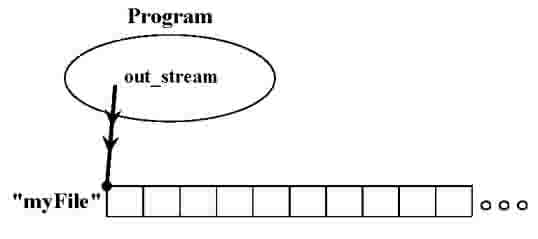

..  Copyright (C) Jan Pearce and Brad Miller
    This work is licensed under the Creative Commons Attribution-NonCommercial-ShareAlike 4.0 International License. To view a copy of this license, visit http://creativecommons.org/licenses/by-nc-sa/4.0/.

Manejo de archivos
~~~~~~~~~~~~~

El manejo de archivos en C++ también usa un ``stream`` de manera similar a las funciones cout y cin de ``<iostream>``. 
La biblioteca que permite la entrada y salida de archivos es ``<fstream>``.

Debe declarar cualquier flujo de archivos antes de usarlos para leer y escribir datos. Por ejemplo, las siguientes 
sentencias informan al compilador que cree un flujo llamado ``in_stream`` que es un objeto de flujo de archivo de entrada, 
``<ifstream>``, y otro llamado ``out_stream`` que es un objeto de flujo de salida. objeto de secuencia de archivos, ``<ofstream>``.
::

    ifstream in_stream;
    ofstream out_stream;

Funciones de Miembro y Precisión
~~~~~~~~~~~~~~~~~~~~~~~~~~~~~~

Una función que está asociada con cierto tipo de objeto se denomina **función miembro** de ese objeto. 
Ya ha usado las funciones miembro ``setf(...)`` y ``precision(...)`` para formatear nuestros flujos de salida usando ``cout``. 
Estas funciones se incluyen brevemente a continuación:

::

    // Use la función miembro de cout "set flags", llamada setf
    // El argumento aquí significa usar un punto fijo en lugar de una notación científica.
    cout.setf(ios::fixed);

    // Use la función setf de cout nuevamente, pero esta vez
    // El argumento le dice a cout que muestre el punto decimal
    cout.setf(ios::showpoint);

    // Use la función miembro de cout, llamada Precisión
    // El argumento indicado para mostrar 2 dígitos de precisión.
    cout.precision(2);

Operaciones de archivo
~~~~~~~~~~~~~~~
Habiendo creado un flujo con la declaración anterior, podemos conectarlo a un archivo (es decir, abrir el archivo) 
usando la función miembro ``abrir (nombre de archivo)``. Por ejemplo, la siguiente instrucción permitirá que el 
programa C++ abra el archivo llamado "myFile.txt", suponiendo que existe un archivo en el directorio actual, 
y conectará ``in_stream`` al principio del archivo:

::

    in_stream.open("myFile.txt");

Una vez conectado, el programa puede leer de ese archivo. Gráficamente, esto es lo que sucede:

.. _fig_read_read:

.. figure:: Figures/Read_Open.jpg
  :align: center
  :alt: image

la clase ``<ofstream>`` también tiene una función miembro ``open(filename)``, pero es definido diferente. Considere la declaración siguiente:

::

    out_stream.open("anotherFile.txt");

Gráficamente, obtenemos un flujo de datos que sale del programa:

.. _fig_read_write:

Debido a que out_stream es un objeto de tipo ``<ofstream>``, conectarlo al archivo llamado "anotherFile.txt" 
creará ese archivo si no existe. Si el archivo "anotherFile.txt" ya existe, se borrará y se reemplazará con 
lo que se introduzca en el flujo de salida.

Para desconectar ``ifstream`` in_stream de cualquier archivo que haya abierto, usamos su función miembro ``close()``:

::

    in_stream.close();

Para cerrar el archivo para ``out_stream``, usamos su función ``close()``, que también agrega un marcador de fin de archivo para indicar dónde está el final del archivo:
::

    out_stream.close();

Responda la siguiente pregunta sobre el uso de la biblioteca ``fstream``:

.. mchoice:: stream_library_1
   :answer_a: Si, ofstream es requerido para editar el archivo. 
   :answer_b: Si, el uso de ifstream borrará el archivo sin usar ofstream primero.
   :answer_c: No, el uso de ofstream en un archivo que ya tiene información borrará todo el archivo.
   :answer_d: No, ofstream es exclusivamente usado para leer archivos.
   :correct: c
   :feedback_a: Incorrecto! Aunque es necesario para editar archivos, usar ofstream primero causará problemas cuando abra un archivo que tenga un trabajo anterior guardado.
   :feedback_b: Incorrecto! ifstream solo se usa para leer archivos, por lo tanto nunca editará el contenido de uno.
   :feedback_c: Correcto!
   :feedback_d: Incorrecto! ifstream se utiliza para leer archivos. 

   Digamos que desea agregar texto a un archivo que ya contiene información importante. 
   ¿Sería una buena idea usar primero ``ofstream`` para abrir el archivo?

Manejo de fallas de E/S 
~~~~~~~~~~~~~~~~~~~~~~~~~

Las operaciones con archivos, como abrir y cerrar archivos, suelen ser una fuente de errores 
de tiempo de ejecución por varios motivos. Los programas bien escritos siempre deben incluir 
rutinas de verificación de errores y manejo de posibles problemas al tratar con archivos. 
La verificación y el manejo de errores generalmente implican que el programador inserte 
declaraciones en funciones que realizan E/S para verificar si alguna de las operaciones ha fallado. 
En C (el predecesor de C++), la llamada al sistema para abrir un archivo devuelve un valor después 
de llamar a la función. Un número negativo significa que la operación falló por algún motivo, 
que el programa puede verificar para ver si la lectura de un archivo está bien. En C++, 
la función miembro ``fail()`` proporciona un mecanismo simple de comprobación de errores:

::

    in_stream.fail();

Esta función devuelve ``verdadero`` solo si la operación de transmisión anterior para in_stream no tuvo éxito, 
como si intentáramos abrir un archivo que no existe. Si ha ocurrido una falla, in_stream puede estar dañado 
y es mejor no intentar más operaciones con él.

El siguiente fragmento de código de ejemplo cierra el programa por completo en caso de que falle una operación de E/S:

.. raw :: html

    

        <iframe height="400px" width="100%" src="https://repl.it/@sheepof/Manejo-de-archivos?lite=true" scrolling="no" frameborder="no" allowtransparency="true" allowfullscreen="true" sandbox="allow-forms allow-pointer-lock allow-popups allow-same-origin allow-scripts allow-modals"></iframe>
    

Después de abrir el archivo "myFile.txt", el condicional ``if`` verifica si hubo un error. Si es así, 
el programa emitirá el mensaje de error de disculpa y luego saldrá. La función ``exit(1)`` de la biblioteca 
``cstdlib`` permite que el programa termine en ese punto y que devuelva un "1" frente a un "0", lo que indica 
que se ha producido un error.

Para obtener más información sobre el manejo de errores, vea la sección 1.11.

Leer y Escribir con Secuencias de Archivos
~~~~~~~~~~~~~~~~~~~~~~~~~~~~~~~~~~~~~

Como los flujos de E/S de archivos funcionan de manera similar a ``cin`` y ``cout``, los operadores ">>" y "<<" realizan la misma dirección de datos para archivos, con exactamente la misma sintaxis.

Por ejemplo, la ejecución de la siguiente instrucción escribirá el número 25, un espacio, el número 15 y otro espacio en el flujo de salida out_stream.

::

    out_stream << 25 << endl;
    out_stream << 15 << endl;

El espacio adicional después del valor 25 es importante porque los datos en un archivo de texto generalmente están separados 
por un espacio, una tabulación o una nueva línea. Sin el espacio, el valor 2515 se colocará en el archivo y las operaciones 
de lectura posteriores en ese archivo considerarán 2515 como un valor único. Por ejemplo, suponga que después de la instrucción 
anterior, el programa abre el mismo archivo con el flujo de entrada in_stream. La siguiente declaración colocaría el número 25 
en la variable ``inputn``.

::

    int inputn;
    in_stream >> inputn;

El Fin de Archivo (EOF) para Sistemas que implementan eof()
~~~~~~~~~~~~~~~~~~~~~~~~~~~~~~~~~~~~~~~~~~~~~~~~~~~~~~

Hasta ahora, la suposición era que el programador sabía exactamente cuántos datos leer de un archivo abierto. 
Sin embargo, es común que un programa siga leyendo un archivo sin tener idea de cuántos datos existen. 
La mayoría de las versiones de C++ incorporan un indicador de fin de archivo (EOF) al final del archivo 
para que los programas sepan cuándo detenerse. De lo contrario, podrían leer datos de un archivo diferente 
que estaba justo después en el disco duro, lo que puede ser desastroso.

Muchos entornos de desarrollo tienen bibliotecas de E/S que definen cómo funciona la función miembro eof() 
para las variables ifstream para probar si este indicador se establece en ``verdadero`` o ``falso``. Por lo general, 
a uno le gustaría saber cuándo no se ha alcanzado el EOF, por lo que una forma común es un valor booleano negativo. 
Una implementación alternativa es seguir leyendo usando el operador >>; si esa operación fue exitosa 
(es decir, había algo en el archivo que se leyó), este éxito se interpreta como un 1 (verdadero).

Por cierto, es por eso que si olvidas el segundo signo igual en una comparación entre una variable y un valor, 
le estás asignando el valor a la variable, lo cual es una operación exitosa, lo que significa que la condición 
termina evaluándose como ``verdadera``.

Los siguientes dos fragmentos de código resaltan las posibilidades:

Usando la función miembro ``eof()``

::

    while(!in_stream.eof()) {
        // declaraciones para ejecutar 
        // mientras EOF no ha sido 
        // alcanzado
    }

Usando el operador >> 

::

    while(in_stream>>inputn) {
        // declaraciones para ejecutar 
        // mientras que las lecturas son exitosas
    }

Aquí hay un ejemplo de un programa que esencialmente usa la segunda técnica
mencionado anteriormente para leer todos los números en un archivo y generarlos en un formato más ordenado.
El bucle ``while`` para escanear un archivo se encuentra en la función ``make_neat(...)``.
::

    // Ilustra las instrucciones de output 
    // Lea todos los números en el archivo rawdata.dat y escriba los números
     // a la pantalla y al archivo clean.dat con un formato ordenado.

    #include <cstdlib>  // para la función de salida
    #include <fstream>  // para funciones miembro de E/S
    #include <iomanip>  // para la función setw
    #include <iostream> // para cout
    using namespace std;
    void make_neat(
        ifstream &messy_file,
        ofstream &neat_file,
        int number_after_decimalpoint,
        int field_width);

    int main() {
        ifstream fin;
        ofstream fout;

        fin.open("rawdata.txt");
        if (fin.fail()) { // 
            cout << "Error al abrir el archivo de entrada." << endl;
            exit(1);
        }

        fout.open("neat.txt");
        if (fout.fail()) { // ¡Oops, el archivo de salida abierto falló!
            cout << "Error al abrir el archivo de salida.\n";
            exit(1);
        }
        make_neat(fin, fout, 5, 12);

        fin.close();
        fout.close();
        cout << "Termine el programa." << endl;
        return 0;
    }
    // Usa iostreams, flujos a la consola, y iomanip:
    void make_neat(
        ifstream &messy_file,
        ofstream &neat_file,
        int number_after_decimalpoint,
        int field_width) {
        // establezca el formato para el archivo de salida más ordenado.
        neat_file.setf(ios::fixed);
        neat_file.setf(ios::showpoint);
        neat_file.setf(ios::showpos);
        neat_file.precision(number_after_decimalpoint);
        // establecer el formato para la salida a la pantalla también.
        cout.setf(ios::fixed);
        cout.setf(ios::showpoint);
        cout.setf(ios::showpos);
        cout.precision(number_after_decimalpoint);
        double next;
        while (messy_file >> next) { // while there is still stuff to read
            cout << setw(field_width) << next << endl;
            neat_file << setw(field_width) << next << endl;
        }
    }

    // Código escrito por Jan Pearce
    
Este es el documento ``rawdata.txt`` introducido en el archivo ``make_neat(...)``.

::

    10 -20 30 -40
    500 300 -100 1000
    -20 2 1 2
    10 -20 30 -40

Y este es el resultado esperado.

::

       +10.00000
       -20.00000
       +30.00000
       -40.00000
      +500.00000
      +300.00000
      -100.00000
     +1000.00000
       -20.00000
        +2.00000
        +1.00000
        +2.00000
       +10.00000
       -20.00000
       +30.00000
       -40.00000

.. raw :: html

    

        <iframe height="400px" width="100%" src="https://repl.it/@sheepof/manejo?lite=true" scrolling="no" frameborder="no" allowtransparency="true" allowfullscreen="true" sandbox="allow-forms allow-pointer-lock allow-popups allow-same-origin allow-scripts allow-modals"></iframe>
    

El archivo de entrada ``rawdata.txt`` debe estar en el mismo directorio (carpeta) que el programa para que se abra correctamente. El programa creará un archivo llamado "neat.dat" para mostrar los resultados.

.. mchoice:: eofFirst
    :multiple_answers:
    :answer_a: Para evitar que un programa escriba en otros archivos.
    :answer_b: Para evitar que un programa se detenga.
    :answer_c: Para asegurarse de que no se desborde en el búfer temporal.
    :answer_d: Para detener un flujo de archivos de entrada.
    :correct: a,c,d
    :feedback_a: Si, Los EOF están destinados a evitar que el programa sobrescriba un archivo.
    :feedback_b: No del todo, el objetivo de los EOF es hacer lo contrario.
    :feedback_c: Sí, los EOF evitan el desbordamiento en el búfer temporal.
    :feedback_d: Sí, los EOF detienen los flujos de archivos de entrada.

    ¿Cuáles son buenos casos de uso para los EOF en la programación de C++?
    
Pasar flujos como Parámetros
~~~~~~~~~~~~~~~~~~~~~~~~~~~~~

En el programa anterior, ve que los flujos de entrada y salida se pasan al archivo
vía ``pasar por referencia``. Este hecho puede parecer al principio una elección sorprendente.
hasta que te das cuenta de que una transmisión debe cambiarse para poder leer o escribir en ella.
En otras palabras, a medida que las corrientes "fluyen", se modifican.
Por esta razón, todos los flujos siempre se pasarán por referencia.

Nombres de Archivos y Cadenas C
~~~~~~~~~~~~~~~~~~~~~~~~

En las versiones modernas de C++, puede usar la biblioteca <string> para los nombres de archivo,
pero las versiones anteriores de C++ requerían el uso de C-strings.
El programa anterior intentará abrir el archivo llamado "rawdata.txt" y
enviar sus resultados a un archivo llamado "neat.dat" cada vez que se ejecuta,
que no es muy flexible. Idealmente, el usuario debería poder ingresar
nombres de archivo que usará el programa en lugar de los mismos nombres.
Anteriormente hemos hablado sobre el tipo de datos ``char`` que permite a los usuarios almacenar
y manipular un solo carácter a la vez. Una secuencia de caracteres como "myFileName.dat"
se puede almacenar en un array de caracteres llamada ``c-string``, que se puede declarar de la siguiente manera:
::

    // Syntax: char C-string_name[LEN];
    // Example:
    char filename[16];

Esta declaración crea una variable llamada ``filename`` que puede contener una cadena de
longitud de hasta ``16``-1 caracteres.
Los corchetes después del nombre de la variable indican al compilador el máximo
número de almacenamiento de caracteres que se necesita para la variable.
Un carácter ``\0`` o ``NULL`` termina la cadena C, sin que el sistema sepa cuánto de
el array se utiliza realmente.

    Advertencias:
        1. ¡El número de caracteres para una cadena C debe ser uno mayor que el número de caracteres reales!
        2. Además, LEN debe ser un número entero o una const int declarada, no puede ser una variable.

**C-strings** son un tipo de cadena más antigua que se heredó del lenguaje C, y las personas con frecuencia se refieren a ambos tipos como "cadenas", lo que puede resultar confuso.

Por lo general, `string` de la biblioteca ``<string>`` debe usarse en todos los demás casos cuando no
trabajar con nombres de archivos o cuando se puede usar una versión moderna de C++.

Poniendolo todo junto
~~~~~~~~~~~~~~~~~~~~~~~

El siguiente programa combina todos los elementos anteriores y le pide al usuario los nombres de los archivos de entrada y salida. Después de probar las fallas abiertas, leerá tres números del archivo de entrada y escribirá la suma en el archivo de salida.
::

    #include <cstdlib>  // para la función de cerrar (exit)
    #include <fstream>  // para las funciones miembros de entrada y salida (E/S)
    #include <iostream> // para usar cout
    using namespace std;

    int main() {
        char in_file_name[16],
            out_file_name[16]; // los nombres de archivos pueden tener como máximo 15 caracteres
        ifstream in_stream;
        ofstream out_stream;

        cout << "Este programa sumará tres números tomados de un archivo de entrada\n"
             << "y escribirá la suma en un archivo de salida." << endl;
        cout << "Introduzca el nombre del archivo de entrada (máximo de 15 caracteres):\n";
        cin >> in_file_name;
        cout << "\nIntroduzca el nombre del archivo de salida (máximo de 15 caracteres):\n";
        cin >> out_file_name;
        cout << endl;

        // Apertura y verificación de archivos de entrada y salida condensados.
        in_stream.open(in_file_name);
        out_stream.open(out_file_name);

        if (in_stream.fail() || out_stream.fail()) {
            cout << "Error al abrir el archivo de entrada o salida.\n";
            exit(1);
        }

        double firstn, secondn, thirdn, sum = 0.0;
        cout << "Lectura de números del archivo " << in_file_name << endl;
        in_stream >> firstn >> secondn >> thirdn;
        sum = firstn + secondn + thirdn;

        // El siguiente conjunto de líneas escribirá en la pantalla
        cout << "La suma de los primeros 3 números de " << in_file_name << " es "
             << sum << endl;

        cout << "Colocando la suma en el archivo" << out_file_name << endl;

        // El siguiente conjunto de líneas escribirá en el archivo de salida
        out_stream << " La suma de los primeros 3 números de" << in_file_name
                   << " es " << sum << endl;

        in_stream.close();
        out_stream.close();

        cout << "Final del programa." << endl;

        return 0;
    }

.. raw :: html

    

        <iframe height="400px" width="100%" src="https://repl.it/@sheepof/manejotres?lite=true" scrolling="no" frameborder="no" allowtransparency="true" allowfullscreen="true" sandbox="allow-forms allow-pointer-lock allow-popups allow-same-origin allow-scripts allow-modals"></iframe>
    

Resumen 
~~~~~~~
1. El manejo de archivos en C++ usa ``stream`` similar a cout y cin en la biblioteca ``<iosteam>`` pero es ``<fstream>`` para el flujo de archivos.

2. ``ifstream in_stream`` crea un objeto de flujo de entrada, in_stream, que se puede usar para ingresar texto desde un archivo a C++.

3. ``ofstream out_stream`` crea un objeto de flujo de salida, out_steam, que se puede usar para escribir texto de C++ en un archivo.

4. Fin del documento (End-of-File) o ``.eof()`` es un método para las variables de instancia de fstream, objetos de flujo de entrada y salida, y puede usarse para llevar a cabo una tarea hasta que un archivo haya finalizado o realice alguna tarea. después de que un archivo ha finalizado.

Compruébalo tú mismo
~~~~~~~~~~~~~~

.. mchoice:: stream_library_2
   :multiple_answers:
   :answer_a: fstream
   :answer_b: ifstream
   :answer_c: ofstream
   :answer_d: iostream
   :correct: a,d
   :feedback_a: Si, fstream es una biblioteca para manejar la entrada y salida de archivos. 
   :feedback_b: No, ifstream es un tipo de objeto para manejar input. 
   :feedback_c: No, ofstream es un tipo de objeto para manejar        is an object type for handling output.
   :feedback_d: Si, iostream es una biblioteca para manejar la entrada de entrada (input) y salida (output).

   ¿Cuáles de las siguientes son bibliotecas para entrada (input) y salida (output) de C++? (Elija todas las que sean verdaderas).

.. dragndrop:: dnd_streamuse
   :feedback: ¿Qué biblioteca se utiliza para qué tarea?
   :match_1: fstream|||Quiero escribir a escribir a un archivo
   :match_2: iostream|||Quiero escribir a la consola 

   Arrastre la biblioteca correspondiente al uso que le daría.

.. fillintheblank:: file_reading

  Complete el espacio en blanco con el valor de ``inputn`` cuando se ejecute el siguiente código.

  ::

      #include <fstream>
      #include <cstdlib>
      #include <iostream>
      using namespace std;
      
      main(){
        ifstream in_stream;
        ofstream out_stream;
        int inputn;

        out_stream.open("otroArchivo.txt");
        out_stream << 25;
        out_stream << 15 << endl;
        out_stream << 101 << endl;

        in_stream.open("otroArchivo.txt");
        in_stream >> inputn;
        cout << inputn;
        in_stream >> inputn;
      }

  - :101: ¡Esa es la respuesta correcta! ¡Buen trabajo!
    :25: No. Pista: ``inputn`` se cambia dos veces. 
    :2515: No. Pista: ``inputn`` se cambia dos veces.
    :15: No. Pista: tenga en cuenta que no hay espacio entre los primeros 25 y 15!
    :.*: No. Pista: ¡Observe qué números específicos se están escribiendo en el archivo!
